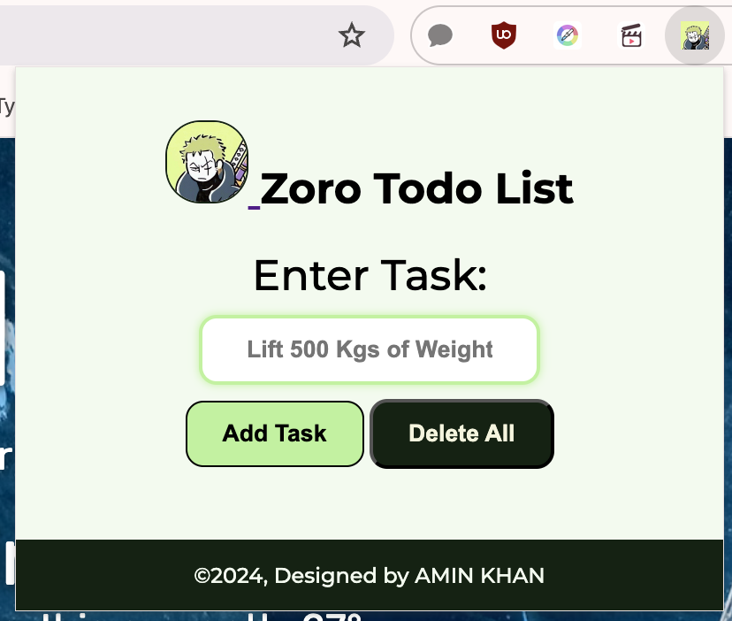

# Zoro Todo List Extension ⚔️



A Chrome extension to help you manage and track your tasks, inspired by Zoro from One Piece. Designed for simplicity and productivity.

## Features
- **Add Tasks**: Quickly add tasks with a button or by pressing Enter.
- **Delete Individual Tasks**: Remove tasks you no longer need.
- **Mark as Complete**: Use checkboxes to keep track of completed tasks.
- **Clear All Tasks**: Double-click the "Delete All" button to clear all tasks.

## Installation
1. **Download/Clone the Repository**: 
   ```bash
   git clone https://github.com/your-username/zoro-todo-list.git

2. **Load the Extension in Chrome**

1. Open Chrome and navigate to the Extensions page at `chrome://extensions/`.
2. Enable **Developer Mode** at the top right.
3. Click **Load unpacked** and select the folder containing your extension files.

### Usage

- **Adding a Task**: Type a task in the input field and click "Add Task" or press Enter.
- **Deleting Tasks**: Click the "DEL" button next to a task to delete it.
- **Clearing All Tasks**: Double-click the "Delete All" button to remove all tasks.
- **Task Persistence**: All tasks are saved to `localStorage`, so they’ll remain even after closing Chrome.

### File Structure

- **index.html**: The main HTML structure.
- **style.css**: Styles for the UI.
- **script.js**: JavaScript file for managing tasks and interactions.
- **manifest.json**: Metadata for Chrome to recognize this as an extension.
- **Icons**: `icon16.png`, `icon48.png`, `icon128.png` for the extension in different sizes.

### Contributing

Want to improve the Zoro Todo List? Feel free to fork the repository and submit pull requests. All contributions are welcome!

### License

This project is open-source and available under the MIT License.
